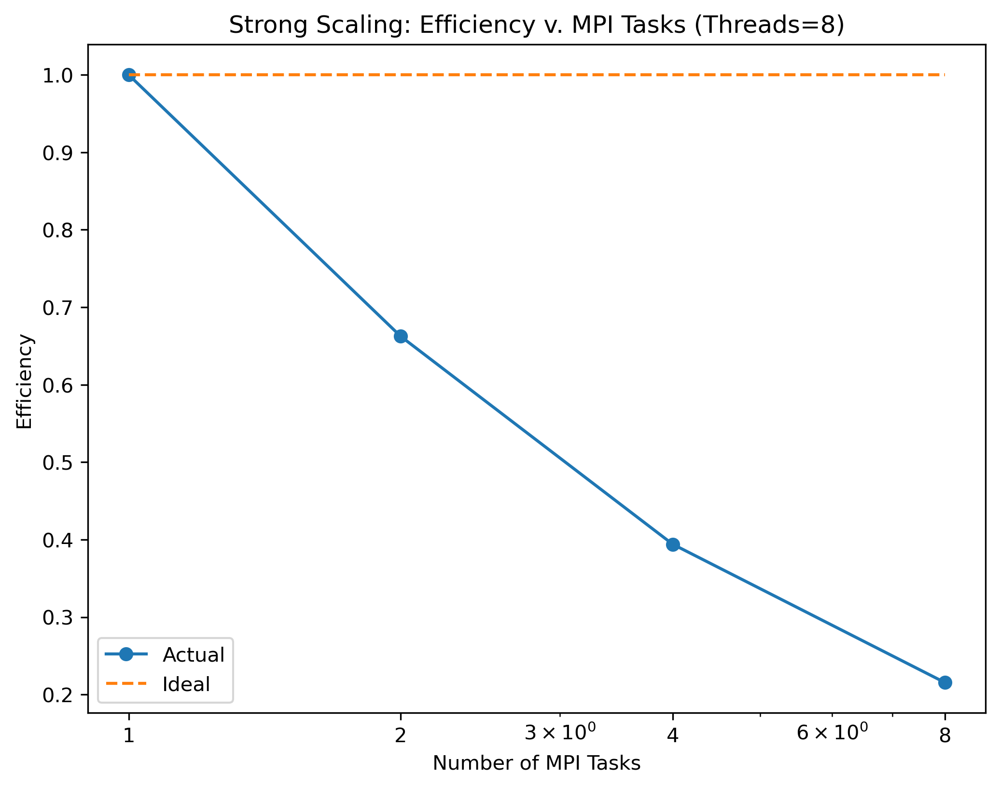

[](https://classroom.github.com/a/UHhs5Uma)
# Final Projects

## Due: EOD, 30 April

## Introduction

This program attempts to do a k-coloring of a sparse graph.

This project report first explains the motivation of a k-coloring on a sparse graph, then describes some background on the graph and the algorithm used to do the k-coloring.
In the Methods section, the algorithm is described and its correctness is argued. Various implementation details are discussed to allow a reader to replicate the project. Additionally, the methodology used to obtain the results is described.
In the Results section, the results of the project are presented and discussed.
Finally, the Conclusion section summarizes the project and discusses future work.

### Motivating Applications

Parallel (scientific) computing programs and compilers both have a dependency on job dependency, often modeled using a graph structure.

**Example application for register allocation.**
First proposed by [Chaitin et al.](https://doi.org/10.1016%2F0096-0551%2881%2990048-5), vertices represent the live ranges of variables to be allocated.
Live ranges that are live at the same time are connected by an edge.
By a k-coloring, we can effectively assign a register to each variable, such that no two variables that are live at the same time are assigned the same register.

In a "real world" example, a compiler would do this as part or a larger algorithm:
1. Find live ranges of variables by static analysis.
2. Build the graph representing the live ranges and their overlaps.
3. Find a k-coloring of the graph (k is the number of registers). Note that k is usually very small compared to the number of variables (e.g. k=16 for x86-64, k=31 for ARM64).
4. Most likely, not all variables can be mapped to registers, so the compiler will have to put some variables in memory ("spill").

Note that register allocation graphs (interference graphs) are usually sparse.
Although not a direct measure of sparsity, [Cai 2025](https://doi.org/10.1145/3669940.3707286) notes that the treewidth (see next paragraph) of a register allocation graph at most 7, and at most 6 for most C programs.
This means that the number of edges is very low between clusters (i.e. set of vertices that are mapped to a single vertex in the tree decomposition with minimum width), and therefore the graph is sparse.

One definition of the treewidth of a graph is the minimum width of all tree decompositions of said graph ([O'Donnell 2013](https://www.cs.cmu.edu/~odonnell/toolkit13/lecture17.pdf)).
A tree decomposition of a graph is a tree where each node is mapped to a vertex on a tree.
In the figure below, the tree decomposition is shown below the graph.
The tree decomposition shown has the minimum width.
Since the minimum width of the tree decomposition is 2, the treewidth of the graph is 2.


Figure 1. A graph and its tree decomposition with a minimum width on the decomposition's edges. David Eppstein, Public domain, via Wikimedia Commons
(If the background is clear the edges are being hidden; click the image to see the edges.)

**Example application for job scheduling.**
Each task is represented by a vertex. Each dependency is represented by an edge.
A k-coloring of this graph represents a scheduling of the tasks, such that no two tasks that are dependent on each other are scheduled at the same time.
Since each dependency is represented by an edge, the graph must be simple (it would not make sense to have a dependency between two tasks that are the same task).
Additionally, a dense graph usually has cycling dependencies, which would make it impossible to schedule the tasks.
Therefore, in most cases, the graph is sparse, and a k-coloring algorithm for sparse graphs is appropriate.

[Leighton 1979](https://nvlpubs.nist.gov/nistpubs/jres/84/jresv84n6p489_a1b.pdf) lists a few other applications:
- exam scheduling in the minimum number of time slots
- storing chemicals in a minimum number of containers (where two chemicals cannot be stored in the same container if they react with each other)

### The Nature of the Graph

This section describes the nature of the graph used in this project.
The graph is assumed to be sparse, i.e. the number of edges is much smaller than the number of vertices squared.
Additionally, the graph is assumed to be simple, connected, and undirected.
To simplify testing, the graph will have an equal number of vertices and edges in most cases.

### Independent Set

The independent set of a graph is a set of vertices such that no two vertices in the set are adjacent.
A maximal independent set (MIS) is an independent set that cannot be extended by adding an adjacent vertex.

A MIS of a graph corresponds to a single color in a k-coloring of the graph.

Note that the optimal k-coloring of a graph is NP-hard, so we will not attempt to find the optimal k-coloring. We will just find a k-coloring of the graph.

### Known Algorithms

Luby's algorithm ([Luby 1986](https://courses.csail.mit.edu/6.852/08/papers/Luby.pdf), section 3.2 "Algorithm B") is a randomized algorithm for finding a maximal independent set of a graph.
The algorithm runs in parallel on a concurrent read exclusive write parallel RAM (CREW PRAM) model.

There is also a greedy algorithm for finding an MIS.
This algorithm works by adding vertices to the set such that no two vertices in the set are adjacent.
At each step, if there are multiple vertices that can be added to the set, the tie is broken arbitrarily.

Notably, this algorithm is not (easily) parallelizable, as the algorithm is dependent on the previous step.
However, [Blelloch 2012](https://doi.org/10.1145/2312005.2312058) shows that the dependence is actually O(log²n)-high, and so lends fairly well to parallelization (though this requires lots of communication between threads compared to Luby's algorithm).

## Methods

This project was implemented using OpenMP and OpenMPI.
The code generates a random graph, performs a k-coloring of graph (where k large enough to guarantee a coloring), and then verifies that the coloring is correct.
To check that the parallelism is correct, the code runs the serial version of the algorithm and compares the results.
The results are in [DOT](https://graphviz.org/doc/info/lang.html) format, and results are compared by verifying the files are bit-for-bit identical.
Although this method of checking the result is stricter than necessary, it is a good way to ensure that the parallelism is correct.

### Graph Properties

The graph will be given in adjacency matrix format, where the matrix itself is represented in compressed sparse row storage (CSR) format.
Since we assume the graph is not mutated in any step of any algorithm, there is no concern of mutations "locking up" the graph in a parallel algorithm.

Requirements for the graph object (implemented in `./src/graph.h` and `./src/graph.c`):
- Represent a simple graph (`struct matrix`).
- Create a random simple graph of n vertices and m edges (`struct matrix *matrix_create_random(size_t n_vertices, size_t nnz)`).
- Output the graph to dot format (`void matrix_as_dot(struct matrix *m, FILE *f)`).
- Return whether two vertices are adjacent (`bool matrix_query(struct matrix *m, number_t i, number_t j)`).
- Return the degree of each vertex (`void matrix_degree(struct matrix *m, size_t *degree)`).

### Implemented Algorithms

Algorithm implementation in `./src/solver.{h,c}`, executable in `./src/test_solver_distributed.c`.

This section covers each algorithm used, it's parallelism properties, and correctness.
It also covers the parallel paradigm used for each algorithm.

As an overview, the program first uses the [Subgraph Detection Algorithm](#subgraph-detection-algorithm) to find suitable subgraphs for each OpenMPI rank.
Then, each rank uses the [Graph Coloring Algorithm](#graph-coloring-algorithm) (which internally uses [Luby's algorithm](#lubys-algorithm)) to color its own subgraph.
Each subgraph's coloring then gets merged into the original (full-graph) coloring, completing the task.

#### Graph Coloring Algorithm

Runtime: O(n²) (worst case).

The algorithm is a trivial application of Luby's maximal independent set algorithm.
The algorithm is as follows (explanation in parentheses):
1. Find the vertex with the largest degree, `v`.
2. Create sets `initial_s[0]` to `initial_s[k-1]` which each (combined) partition the set containing `v` and its neighbors.
3. Run Luby's maximal independent set algorithm on each of the sets `initial_s[i]`, with the graph where all vertices that are colored are removed.
  - (Note there is no data dependency between the sets, so they can be run in parallel.)
4. Color all isolated vertices (i.e. vertices with degree 0) with an arbitrary color.
5. Done

##### Correctness
Since the sets `initial_s[i]` are disjoint, the algorithm is guaranteed to give a valid k-coloring of the graph.
However, note that this algorithm does not guarantee a minimum coloring of the graph.

(To show that this algorithm does not necessarily produce a minimum coloring,) consider the following graph:
```
    1
   / \
  2---3
 / \ / \
4---5---6
```
A maximal independent set is {1, 4, 6}. We color this red.
Then, vertices 2, 3, and 5 cannot be colored in three colors.
We now show a 3-coloring of the graph: 1 and 5 are red, 2 and 6 are blue, and 3 and 4 are green.
Therefore, the algorithm given above does not necessarily produce a minimum coloring.

##### Data Parallelism

The algorithm cannot be run in a data-parallel manner as each iteration of Luby's algorithm (step 3) is dependent on the previous iteration (previous iterations could color a vertex that could be colored by multiple colors).

##### Domain Decomposition

The algorithm can be parallelized by domain decomposition, by performing a tree decomposition and coloring each tree vertex in parallel.
Notice that a subgraph with one vertex connecting to the non-subgraph portions of the graph is trivially colorable with minimal communication between the processes.
In fact, if the degree of that connecting vertex is less than or equal to the number of colors available, we can color without any communication beforehand, and then change the color of the subgraph to match.
Clearly, this approach is quite fast as it requires minimal data transfer (i.e. just the subgraph and the number of colors available), lending itself well to a distributed memory model.

The algorithm to detect these subgraphs is described below:

#### Subgraph Detection Algorithm

Runtime: O(n²) (worst case).

1. For every vertex `u` that has a degree less than `k`:
  1. For each neighbor `v` of the vertex, find the total number of vertices traversable from `v` (excluding `u`).
  2. Select a subset of vertices that together have less than half the number of vertices in the graph.

##### Correctness

Notice that if a subgraph is connected to the main graph by two or more vertices, then step 1.1 would find a subgraph with a size approximately equal to the size of the main graph.
Therefore, all subgraphs selected by this algorithm are guaranteed to be small enough and connected to the main graph by only one vertex.

##### Data Parallelism

Steps 1 and 1.1 can be run in parallel, as there is no data dependency between the vertices.

##### Domain Decomposition

There is no simple domain decomposition, as step 1.1 potentially needs to traverse the entire graph.

#### Luby's Algorithm

Runtime: O(log n) (ideal case).

Note that we use a modified Luby's algorithm:
1. Construct `degree` such that `degree[v]` is the degree of vertex `v`.
2. Let `g_prime` be the given graph.
3. While `g_prime` is not empty:
  1. Construct set `s` by selecting each vertex from `g_prime` with probability `1/(2*degree[v])`.
  2. For every edge `(u,v)` in `g_prime` and which have both endpoints in `s`, remove the vertex of lower degree from `g_prime` (break ties arbitrarily).
  3. Color all vertices in `s` with our given color.
  4. Remove `s` and its neighbors from `g_prime`.
4. Done

##### Correctness
At each stage, we see that `s` is added to the independent set.
Since we remove `s` and its neighbors from `g_prime`, we are guaranteed that our independent set is valid.
Now, once `g_prime` is empty, all vertices have been either colored or was a neighbor of a colored vertex.
Therefore, we are guaranteed that our independent set is valid and maximal when we halt.

##### Data Parallelism
The algorithm can be parallelized by running steps 1, 3.1, 3.2, and 3.3 in parallel (with no coordination between the threads other than fork and join).

### Parameters

The following parameters are used in the project:
- `n_vertices`: number of vertices in the graph.
- `nnz`: number of edges in the graph (`nnz` is from CSR format nomenclature).
- `n_threads`: number of threads to use in the parallel implementation. This directly affects the [Luby's Algorithm](#lubys-algorithm). This is enforced using `OMP_NUM_THREADS`, `OMP_THREAD_LIMIT`, etc.
- `k`: number of colors to use in the k-coloring algorithm. Note that this is always set to be the largest degree of any vertex in the graph, plus one.
- `n_tasks`: number of OpenMPI processes/nodes to use in the parallel implementation. This directly affects the [Graph Coloring Algorithm](#graph-coloring-algorithm). This is enforced by `srun -n <n_tasks> ./<executable>`.

### Verification

The verification of the algorithm is done by ensuring the resultant graph coloring is correct.

Algorithm:
1. For each edge `(u,v)` in the graph:
  1. If `u` and `v` have the same color, return false and halt.
2. Return true and halt.

### Load Balancing

The load balancing of the algorithm is done by partitioning the graph into subgraphs, and assigning each subgraph to a single OpenMPI rank.
The subgraphs are then distributed randomly to the OpenMPI ranks (the subgraphs are generated in an arbitrary order).
The random distribution of the subgraphs generally leads to a good load balancing, as the subgraphs are generated randomly.
However, some subgraphs are inevitably larger than others, and so the load balancing is not perfect, and one rank may spend significantly more time than another rank on the [Graph Coloring Algorithm](#graph-coloring-algorithm).

### Memory Usage

The memory usage of the algorithm is approximately O(n_vertices+nnz), mainly for the CSR representation of the graph.
Note that in a subgraph, the memory usage is O(n_vertices+nnz_subgraph), where `nnz_subgraph` is the number of edges completely within the subgraph.

However, the function that randomly generates test cases uses O(n_vertices²) memory, as it generates a random graph with `nnz` edges in an adjacency matrix format.

## Results

### Strong Scaling

Script: `study_strong.sbatch`, `study_strong_tasks.sbatch`

For this study, `n_vertices=10000`, `nnz=10000`, and `n_threads` and `n_tasks` were varied.


**Thread Efficiency.**
Up to until 4 threads, the algorithm scales well.
However, from 8 threads and above, the algorithm does not scale well, being around 3× slower than ideal for the 8-thread case.
This may due to memory contention, as the algorithm is mainly memory-bound.
Additionally, due to the nature of Luby's algorithm, the memory accesses are completely random, causing cache misses and memory contention.
With only a few cores, this may be manageable (as the cores have work to do), but with more cores, the memory contention can become a bottleneck.
That is most likely the reason for the drop in performance.




**Tasks Efficiency.**
Compared to the thread efficiency, the task efficiency is better, thanks to the minimal communication between the tasks (during coloring).
The main loss in efficiency is then thought to be the communication overhead of having to broadcast the entire matrix to each node/task.

### Thread-to-Thread Speedup

Script: `study_strong.sbatch`

For this study, `n_vertices=10000`, `nnz=10000`, and `n_threads` and `n_tasks` were varied.

 


Up to until 8 threads, there is some speedup.
At 16 threads and above, there is no speedup, and the algorithm becomes slower than the serial version.

As said in the strong scaling section, this is most likely due to memory contention (and random memory accesses) as the algorithm is mainly memory-bound.

### Weak Scaling

For this study, `n_vertices=1000`, `nnz=1000`, and `n_threads` and `n_tasks` were varied (`n_vertices` and `nnz` were scaled up the same).
The plot is shown below.


As can be seen from the graph, the algorithm is not very efficient, and drops to ~0.02 at 8 threads and 4 tasks.
This is most likely due to `n_vertices/nnz` being too small, resulting in overhead from OpenMP and OpenMPI (a larger `n_vertices/nnz` would result in too-large memory usage when e.g. 16 threads/tasks are used, so 1000 was selected).
This is supported by the fact that the efficiency has a shallower slope between 2 and 4 threads, suggesting that (if there is enough work to keep the cores busy) the communication cost is a fairly large factor of the runtime.

### Implications

Register allocation is a very important optimization step in most modern compilers, responsible for a sizeable performance gain.
It is also an NP-hard problem, and therefore this compilation step grows in time (potentially exponentially) with the length of a block, or depending on how much inlining is done.
This means that the register allocation step can be a bottleneck in the compilation process, and therefore a parallel k-coloring algorithm for sparse graphs can directly improve the parallel performance of compilers.
This is especially true for large programs and link-time optimization (LTO), where the register allocation step can take a long time (as another empirical example, is the longest compilation step for large program such as Chromium and Firefox).

## Conclusion

This project implemented a parallel k-coloring algorithm for sparse graphs using both shared-memory and distributed-memory parallelism.
Graph coloring has a wide variety of applications, but this program focused on the sparse graphs generated by register allocation graphs (interference graphs).
The algorithm used was a parallel version of Luby's algorithm, which is a randomized algorithm for finding a maximal independent set of a graph, as well as a greedy algorithm to partition the graph into subgraphs, which are each given to a single OpenMPI rank.
In a broader context, efficient parallel k-coloring algorithms focused on register allocation can directly improve the parallel performance of compilers (register allocation is a very important optimization step in most modern compilers).
Future work includes
a) employing a deterministic version of Luby's algorithm to increase speed (as random numbers are slow to generate and non-deterministic),
b) employing a better parallelization strategy (e.g. using a tree decomposition to color the graph), and
c) exploring other sprase graph data structures (e.g. adjacency list) to improve performance.

## Other References

Other references that are not mentioned above are stored here:
- [Luby's Algorithm for Maximal Independent Set](https://www.cs.cmu.edu/afs/cs/academic/class/15750-s17/ScribeNotes/lecture32.pdf)
  - MIS algorithm can be used for finding the maximal coloring of a single color.
- [Luby 1986](https://courses.csail.mit.edu/6.852/08/papers/Luby.pdf)
  - Paper describing Luby's Monte Carlo algorithm for graph coloring.
- https://www.osti.gov/servlets/purl/1246285
- https://ireneli.eu/2015/10/26/parallel-graph-coloring-algorithms/
- https://paralg.github.io/gbbs/docs/benchmarks/covering/graph_coloring/
- https://doi.org/10.1137/0914041

## Appendix: Slurm Logs

./slurm-2549943.out
preliminary_parallel_perf_check.sbatch
